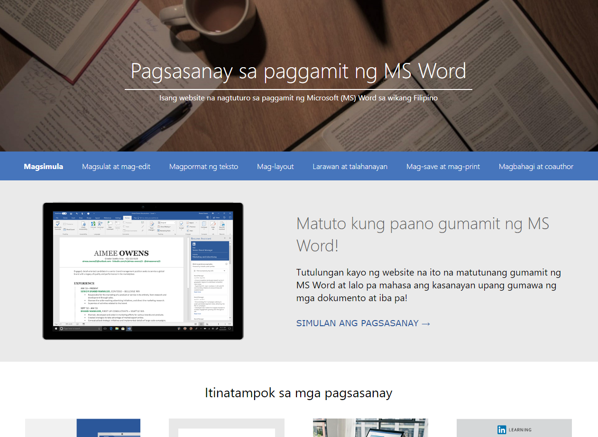

# MS Word Filipino

<div align="center">
    
</div>

Isang <i>static web application</i> na layuning magturo ng paggamit ng MS Word sa wikang Filipino. Ito ay isang proyekto na bahagi ng pananaliksik ng mga mananaliksik-salin, mga mag-aaral ng Politeknikong Unibersidad ng Pilipinas, Sangay ng Siyudad ng Quezon <i>(Polytechnic University of the Philippines, Quezon City Branch)</i> sa paksang "Pananaliksik"

<br>
<br>

## Paglalarawan

<table>
    <tr>
        <th>Pamagat ng Pananaliksik</th>
        <td>
            <div>PAGTUTURO NG PAGGAMIT NG MS WORD SA WIKANG FILIPINO: ISANG PAGSASALIN NG KONTEKSTONG TEKNIKAL
            </div>
        </td>
    </tr>
    <tr>
        <th>Mga Mananaliksik-salin</th>
        <td>
            <ul>
                <li>Buenaventura, Vanessah O. (Nagdisensyo ng <i>web app</i>)</li>
                <li>Cipriaso, Jessie R., Jr.</li>
                <li>Dano, Jomari L.</li>
                <li>Honorio, Lance D. </li>
                <li>Jose, Marc Alexandre S.</li>
                <li>Nubla, Matthew Paul Benedict L.</li>
                <li>Robillos, Elric C.J S.</li>
                <li>Torres, Jetsun Prince P. (Gumawa at nagdesinyo ng <i>web app
                </i></li>
            </ul>
        </td>
    </tr>
    <tr>
        <th>Huling tinapos noong:</th>
        <td>Ika-11 ng Marso, 2019</td>
    </tr>
</table>

<br>
<br>

## Paano i-run?

1. Mag-download ang XAMPP

2. I-download ang files sa pagpindot ng

    > Code > Download Zip

3. I-extract ang files

4. Ilagay ang `mswordfilipino` na <i>folder</i> sa <i>folder directory</i> na ito:

    ```
    C:/xampp/htdocs
    ```

5. I-open ang XAMPP, pindutin ang `start` kahelera ng `Apache`

6. Magbukas ng kahit anong `browser`, i-type ang <i>link</i> na ito upang ma-access

    ```
    http://localhost/mswordfilipino
    ```

<br>
<br>

## Mga ilang Screenshot

<b>Paalala: </b> Karamihan sa mga imaheng ginamit sa <i>web app</i> na ito ay mula sa opisyal na website ng [Micorsoft](https://support.microsoft.com/en-us/office/word-for-windows-training-7bcd85e6-2c3d-4c3c-a2a5-5ed8847eae73).

<div align="center">
    
    <br>
    <small>Home (Itaas na bahagi)</small>
</div>

<br>

<div align="center">
    
    <br>
    <small>Home (Gitnang bahagi)</small>
</div>

<br>

<div align="center">
    
    <br>
    <small>Home (Gitnang bahagi)</small>
</div>

<br>

<div align="center">
    
    <br>
    <small>Introduksyon: Ano ang MS Word?</small>
</div>

<br>

<div align="center">
    
    <br>
    <small>Mag-sulat at Mag-edit</small>
</div>

<br>

<div align="center">
    
    <br>
    <small>Gumawa ng Newsletter Column</small>
</div>

<br>

<div align="center">
    
    <br>
    <small>Maglapat ng tema of Themes</small>
</div>